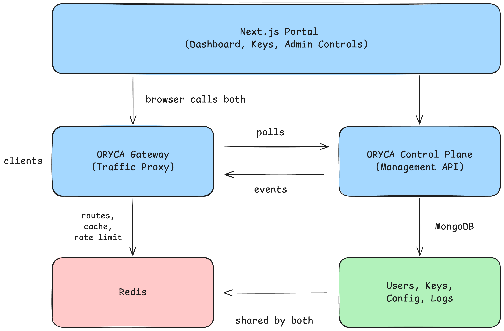

# ORYCA

[](https://github.com/oryca/oryca/actions/workflows/ci.yml)
[](https://github.com/mkenney/software-guides/blob/master/STABILITY-BADGES.md#alpha)
[](https://github.com/oryca/oryca/releases)
[](go.mod)
[](LICENSE)

**An open-source API gateway, at home with geospatial APIs.**

> [!NOTE]
> ORYCA is under active development, ahead of its first tagged release. The gateway and control plane are the settled pieces. The portal is newer and still being polished, so expect rough edges there in particular, and expect things to move before a release is tagged.

[Quick Start](#quick-start) · [Configuration](#configuration) · [Docs](docs) · [Contributing](CONTRIBUTING.md)

Put ORYCA in front of any HTTP API, your own REST and JSON service or an OGC API Features, STAC, Tiles, Styles or SensorThings server. It handles four things you would otherwise build yourself.

- **API keys.** Issues them, checks them on every request.
- **Rate limits.** Per package, per path, so an upstream server is not the thing that fails first.
- **Response rewriting.** Change a response on its way back. Swap an address, hide an upstream's own key, add a header. This is what keeps an API that answers with links to itself from sending clients straight past the gateway.
- **Developer portal.** Sign-up, keys, docs, and a way to try a call in the browser.

Any API gets all four. What geospatial servers get on top is a gateway that knows
their shapes. It suggests the paths a standard expects, and carries rewrite presets
ready to apply. See
[the OGC section](#what-the-ogc-support-is-and-is-not).

---

## Quick Start

You need Docker. Nothing else, no Go and no Node.

### 1. Get the stack running
There is no tagged release yet, so build from source. Docker is still the only
thing you need, the build itself happens inside containers.
```sh
git clone https://github.com/oryca/oryca.git
cd oryca && cp .env.example .env
echo "ORYCA_INTERNAL_SECRET=$(openssl rand -hex 32)" >> .env
docker compose up -d --build
```

The third line is the one thing you have to set. The gateway and the control
plane share that secret, and whoever holds it can read every service and API key
you have, so there is no default to fall back on.

### 2. Find your admin password
An administrator account is created on the first start. Its password is generated and
printed once, in a box near the top of the log.
```sh
docker compose logs control-plane
```

Look for `ROOT ACCOUNT CREATED`. Prefer to choose your own? Put
`ORYCA_API_ROOT_PASSWORD` in `.env` before the first start and this step
disappears.

### 3. Open it
The portal is at **[localhost:3000](http://localhost:3000)**. Log in as `admin@localhost`
with the password from the step above.

The two services answer on 9001 and 9002. You do not need to visit them, but this
is how to check they are up.
```sh
curl localhost:9001/control-plane/api/v1/health
curl localhost:9002/gateway/api/health
```

### 4. Put an API behind it
[Publish your first API](docs/getting-started.md) walks through the four pieces
(upstream, service, package, key) and the one detail that trips everyone up.

---

## Features

**For any API**

- **A sandbox.** Call a published service the way your users will. Pick a path, add headers or a body, send it with a key, and see the status, the timing, the rate-limit headers, and the same call written as `curl`.
- **Request charts and logs.** Volume, response time, status breakdown, and a searchable log. Each person sees their own traffic, administrators see everyone's.
- **Self-service sign-up.** Developers register, get a key, and read the docs without an administrator in the loop.
- **Rewrite rules you write yourself.** JSON by JSONPath, XML by XPath, headers by name, with a starter preset for each action. See [response transforms](docs/response-transforms.md).
- **Serve a path yourself.** A route can answer from a fixed body instead of proxying, for the endpoints your upstream does not have.

**For geospatial servers, on top**

- **Path suggestions per standard.** Pick a service type and ORYCA fills in the paths that kind of server usually exposes (`/conformance`, `/collections`), instead of you typing them by hand.
- **Rewrite presets, including XML.** Ready-made rules cover JSON answers and capabilities documents, where both the address and the upstream's own key sit inside attributes. An applied preset starts switched off, so you read the rules before any traffic meets them.

---

## How it Works

Two Go services and a Next.js portal, on MongoDB and Redis.



1. **Gateway** carries the traffic. It finds the route, checks the key, applies the rate limit, serves from cache and rewrites the response. Its configuration comes from the control plane and lives in Redis, so it keeps serving while the control plane restarts. It never opens a database connection of its own.
2. **Control plane** handles management. Users, services, packages, API keys, the portal's API and the dashboard. It owns MongoDB, and uses Redis to push changes and to read the request logs the gateway writes.
3. **Portal** is one web interface for everyone, with the menu limited by role.

The two Go services never import each other. They talk over HTTP and Redis, written down in [sync-contract.md](docs/sync-contract.md).

### What the OGC support is, and is not

ORYCA does not implement these standards. It sits in front of servers that do, and knows their shapes well enough to suggest paths and rewrite links.

| Standard | Version the hints follow | Note |
| :--- | :--- | :--- |
| OGC API - Features | Part 1: Core 1.0 | Also published as ISO 19168-1 |
| OGC API - Tiles | Part 1: Core 1.0 | |
| OGC API - Styles | Part 1: Core | Still a draft, so the hints may change with it |
| SensorThings API | 1.0, 1.1 | Advertises conformance on the landing page, not at `/conformance` |
| STAC API | 1.0 | A community specification, not an OGC standard |

Each service you register records the version its own upstream implements, which is the number that matters to a client.

---

## Configuration

`.env` at the root configures the whole stack, and every value has a working default. [The configuration reference](docs/configuration.md) lists all of them. The one to change before anything is reachable from a network you do not control is **`ORYCA_INTERNAL_SECRET`**, which the two Go services share. Rotating it? Put the old value in `ORYCA_INTERNAL_SECRET_PREV` first, and the control plane accepts both until you remove it.

Running the binaries yourself, without compose? Then `ORYCA_API_REDIS_DB` and `ORYCA_GW_REDIS_DB` have to match, and their built-in defaults do not (0 and 7). Pub/sub ignores the database number, so a mismatch looks like it works until routes stop arriving. The compose files pin both to 0 for you.

Starting data (settings, email templates, the first package) is YAML in `control-plane/seed/`. It loads once, against an empty database. After that the database wins, so changes made in the portal survive a restart. Administrator credentials are deliberately not in those files, they come from `ORYCA_API_ROOT_EMAIL` and `ORYCA_API_ROOT_PASSWORD`.

One pair is easy to get wrong. `ORYCA_PORTAL_API_URL` and `ORYCA_PORTAL_GATEWAY_URL` are the addresses the portal calls **from the visitor's browser**, so they have to be reachable by your users. A container name like `http://control-plane:9001` will not work. Serving the stack from your own domain means setting both, then restarting the portal.
```sh
docker compose up -d portal
```

---

## Upgrading

```sh
git pull
docker compose up -d --build
```

Your data lives in Docker volumes and is untouched.

---

## Repository Layout

- [`portal/`](portal) is the web interface, for developers and administrators alike.
- [`gateway/`](gateway) is the traffic side, in Go.
- [`control-plane/`](control-plane) is the management side, in Go.
- [`cmd/`](cmd) holds the entry points, three lines each. The servers themselves live in `gateway/app` and `control-plane/app`, so another project can embed one instead of rebuilding its setup. That is also why nothing is hidden behind `internal/`.
- [`tools/`](tools) holds `smoke-test.sh`, which checks a running stack end to end.
- [`docs/`](docs) covers how to use it, and how the pieces agree with each other.
  - [`getting-started.md`](docs/getting-started.md) publishes your first API, from upstream to a working key.
  - [`configuration.md`](docs/configuration.md) lists every environment variable, and what is not one.
  - [`response-transforms.md`](docs/response-transforms.md) covers rewriting a response on its way back, and the presets that do it for you.
  - [`sync-contract.md`](docs/sync-contract.md) records what the gateway and the control plane promise each other.

---

## Local Development & Tests

One Go module, so build and test run from the root.

```sh
go build ./...
go test ./...
```

Running a service on its own, outside Docker, needs three things Docker
otherwise does for you. Mongo and Redis reachable, a `.env` in that service's
own directory (`godotenv` reads the current directory, not the root), and for
the control plane, a signing key pair.

```sh
docker compose up -d mongo redis

cd control-plane
cp .env.example .env
openssl genpkey -algorithm RSA -pkeyopt rsa_keygen_bits:2048 -out auth-private.key
openssl rsa -in auth-private.key -pubout -out auth-public.key
go run ../cmd/oryca-control-plane
```

```sh
cd gateway
cp .env.example .env
go run ../cmd/oryca-gateway
```

`ORYCA_INTERNAL_SECRET` in `control-plane/.env` and `ORYCA_GW_INTERNAL_SECRET`
in `gateway/.env` have to be the same value, the gateway refuses to start
without one. The generated key files are gitignored, and this whole dance is
what the Docker image's entrypoint script does for you on every first start.

`boundary_test.go` fails the build if one binary ever imports the other.

With the stack up, `tools/smoke-test.sh` walks the whole path a person takes. It signs in, publishes a service, issues a key, calls it through the gateway, and checks it reaches the dashboard.

```sh
./tools/smoke-test.sh
```

---

## Contributing

**Issues and questions are welcome.** Bug reports, questions and ideas are the
most useful thing you can send today.

**Pull requests are not open yet, but they will be soon.** We would rather say so
than leave one waiting while we settle how review works.

See [CONTRIBUTING.md](CONTRIBUTING.md) and our [Code of Conduct](CODE_OF_CONDUCT.md).
Found a security problem? Read [SECURITY.md](SECURITY.md) first.

## License

Licensed under the [Apache 2.0 License](LICENSE).
